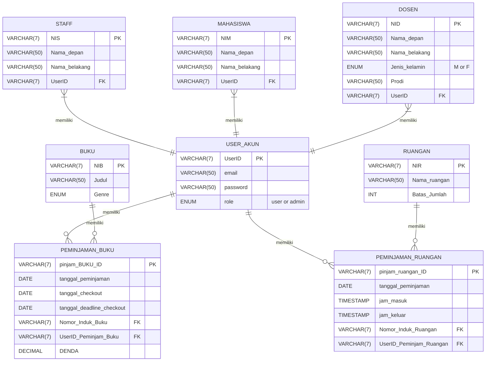

# Database Schema

```mermaid

erDiagram

    DOSEN {
        VARCHAR(7) NID "PK" 
        VARCHAR(50) Nama_depan
        VARCHAR(50) Nama_belakang
        ENUM Jenis_kelamin  "M or F"
        VARCHAR(50) Prodi
        VARCHAR(7) UserID FK
    }

    MAHASISWA {
        VARCHAR(7) NIM "PK"
        VARCHAR(50) Nama_depan 
        VARCHAR(50) Nama_belakang
        VARCHAR(7) UserID FK
    }

    STAFF{
        VARCHAR(7) NIS "PK"
        VARCHAR(50) Nama_depan
        VARCHAR(50) Nama_belakang
        VARCHAR(7) UserID FK
    }

    RUANGAN{
        VARCHAR(7) NIR "PK"
        VARCHAR(50) Nama_ruangan
        INT Batas_Jumlah
    }

    BUKU{
        VARCHAR(7) NIB "PK"
        VARCHAR(50) Judul
        ENUM Genre   
    }

    USER_AKUN{
        VARCHAR(7) UserID PK
        VARCHAR(50) email 
        VARCHAR(50) password
        ENUM role "user or admin"
    }

    PEMINJAMAN_BUKU{
        VARCHAR(7) pinjam_BUKU_ID "PK"
        DATE tanggal_peminjaman 
        DATE tanggal_checkout 
        DATE tanggal_deadline_checkout
        VARCHAR(7) Nomor_Induk_Buku FK 
        VARCHAR(7) UserID_Peminjam_Buku FK 
        DECIMAL DENDA
        %% UNIQUE(Nomor_Induk_Buku, tanggal_peminjaman, tanggal_checkout) 
    }

    PEMINJAMAN_RUANGAN{
        VARCHAR(7) pinjam_ruangan_ID "PK"
        DATE tanggal_peminjaman 
        TIMESTAMP jam_masuk 
        TIMESTAMP jam_keluar 
        VARCHAR(7) Nomor_Induk_Ruangan FK 
        VARCHAR(7) UserID_Peminjam_Ruangan FK
        %% UNIQUE(Nomor_Induk_Ruangan, tanggal_peminjaman, jam_masuk, jam_keluar) 
    }


    USER_AKUN ||--o{ PEMINJAMAN_BUKU : "memiliki"
    USER_AKUN ||--o{ PEMINJAMAN_RUANGAN : "memiliki"
    BUKU ||--o{ PEMINJAMAN_BUKU : "memiliki" 
    RUANGAN ||--o{ PEMINJAMAN_RUANGAN : "memiliki"
    STAFF }|--|| USER_AKUN : "memiliki" 
    MAHASISWA }|--|| USER_AKUN : "memiliki" 
    DOSEN }|--|| USER_AKUN : "memiliki" 

```