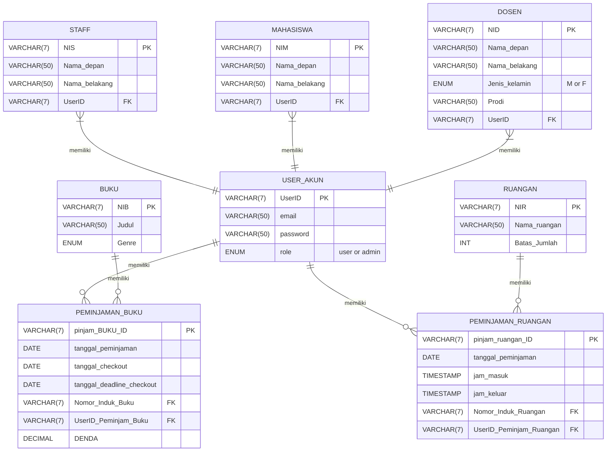

# Database Schema


# 🚀 Run the Project Locally

Follow these steps to set up and run the **Perpustakaan Layanan Digital** project on your machine.

---

## ✅ 1. Clone the Repository

```bash
# Download the project
git clone https://github.com/hhoow0093/Perpustakaan-Layanan-Digital.git

# Navigate into the project folder
cd your-project
```

---

## 🛠️ 2. Backend Setup

### 📂 2.1 Navigate to Backend Folder & Install Dependencies

```bash
cd backend
npm install
```

### 🔐 2.2 Create `.env` File

Create a new file named `.env` inside the backend folder and insert:

```
DB_HOST=localhost
DB_USER=root
DB_PASS=""
DB_NAME=perpustakaan-digital
PORT=5000
```

### ▶️ Start Backend Server

```bash
npm run dev
```

---

## 🧰 XAMPP / Database Setup

1. Open **phpMyAdmin**
2. Create a new database named: `perpustakaan-digital`
3. Import all **DDL & dummy data** located in:  
   `/backend/config/database/*`

---

## 🎨 3. Frontend Setup

```bash
cd frontend
npm install
npm run dev
```

---

✅ You're all set! Both backend & frontend should be running successfully.  
Happy coding! 🎯  
If you face any issues, feel free to open an issue or ask the team 🤝
